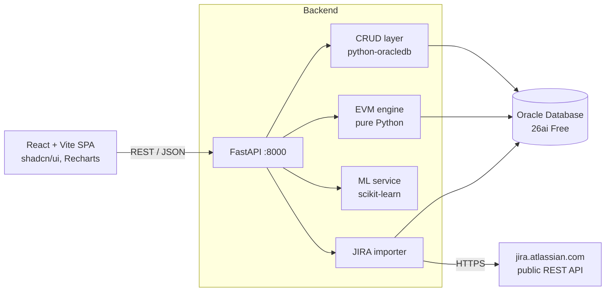
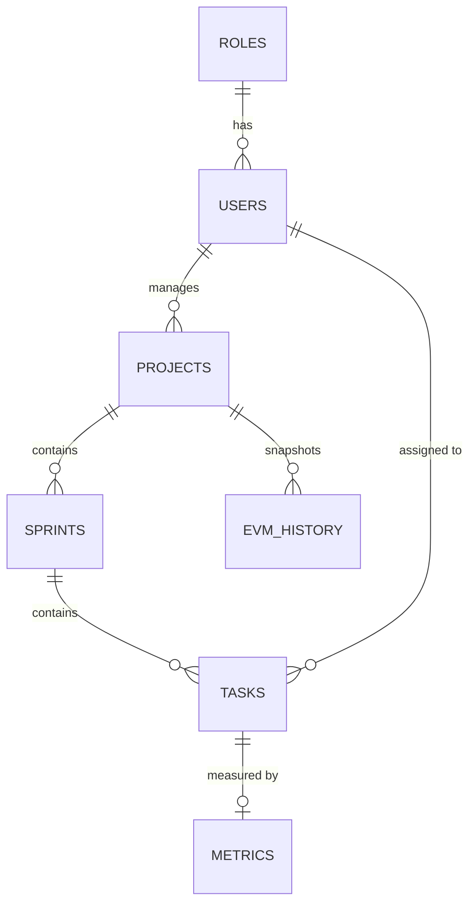

# SmartEVM

**Automated project governance for Agile teams using Earned Value Management (EVM), backed by Oracle Database, served by FastAPI, with ML-based risk forecasting and a React dashboard.**


SmartEVM translates Scrum data (sprints, tasks, story points, defects) into the classic EVM indices that project sponsors understand: **PV, EV, AC, CPI, SPI, EAC, VAC**. It adds a custom **Quality Performance Index (QPI)**, snapshots every calculation to a history table, pulls live issues from a public JIRA instance, and exposes four ML models for cost, schedule, defect and health forecasting.

<!--
SCREENSHOTS - add 2-3 images to docs/screenshots/ and uncomment:


-->

---

## Table of contents

1. [What this project demonstrates](#what-this-project-demonstrates)
2. [Features](#features)
3. [Architecture](#architecture)
4. [How the EVM engine works](#how-the-evm-engine-works)
5. [Database design (Oracle)](#database-design-oracle)
6. [Machine learning module](#machine-learning-module)
7. [API overview](#api-overview)
8. [Getting started](#getting-started)
9. [Testing](#testing)
10. [Project structure](#project-structure)
11. [Design decisions and known limitations](#design-decisions-and-known-limitations)
12. [Roadmap](#roadmap)

---

## What this project demonstrates

| Area | Evidence in this repo |
|---|---|
| **Relational modelling on Oracle** | 7 normalised tables, identity keys, FK cascade / `SET NULL` rules, `CHECK` and `UNIQUE` constraints, 11 indexes |
| **PL/SQL & advanced SQL** | Triggers, 6 views, a stored procedure (`sp_generate_evm_snapshot`), 20 analytical queries using `LAG`, `RANK`, and running `SUM`/`AVG` window functions, `EXPLAIN PLAN`, data-integrity audit queries |
| **Backend engineering** | Layered FastAPI service (routers, service layer, CRUD layer), Pydantic v2 validation, bind variables everywhere (no string-built SQL), transactional imports |
| **Domain logic kept testable** | The EVM calculator is pure Python with no DB dependency; 34 unit checks run without a database |
| **External integration** | Idempotent JIRA importer: paginated fetch, status normalisation, upsert on `external_id`, single atomic commit |
| **Applied ML** | Four scikit-learn Random Forest models served behind REST endpoints with confidence scores |
| **Frontend** | React 18 + TypeScript + Vite, shadcn/ui, React Query, Recharts, role-gated UI (Auth0-ready) |

---

## Features

| Feature | Status |
|---|---|
| Full CRUD for roles, users, projects, sprints, tasks, metrics, EVM history | Implemented |
| EVM calculation per project (PV, EV, AC, CPI, SPI, EAC, VAC, health) with per-sprint breakdown | Implemented |
| EVM snapshots saved to `EVM_History` for trend analysis | Implemented |
| QPI (quality index) per task and per project, recalculable via API | Implemented |
| JIRA import from Atlassian's public instance (no account needed) | Implemented |
| ML predictions: cost overrun, schedule slip, defects, project health | Implemented |
| Oracle views for real-time dashboard, portfolio roll-up, developer workload | Implemented |
| Intelligence page (risk index, anomaly flags, what-if EAC) | UI ready, runs on demo data until backend endpoints are added |
| Project Ledger (task-level PV/EV/AC) | UI ready, runs on demo data until backend endpoint is added |
| Role-based UI gating (Admin / Manager / Viewer) via Auth0 | UI only, API-side JWT validation is on the roadmap |

---

## Architecture



**Request flow for `POST /evm/calculate/{project_id}`:** router validates input, service layer loads project, sprints, tasks and metrics from Oracle, the pure-Python calculator computes the indices, and the result is stored as a snapshot in `EVM_History` and returned to the client.

---

## How the EVM engine works

SmartEVM adapts EVM to Scrum by using **story points as the unit of earned work**.

| Metric | Definition in SmartEVM |
|---|---|
| **BAC** | `Projects.total_budget` |
| **PV** (Planned Value) | Sum of `planned_value` over all sprints of the project |
| **EV** (Earned Value) | Story points of tasks with status `Done` x `budget_per_point` (default `100`, configurable per request) |
| **AC** (Actual Cost) | Sum of `planned_value` of sprints that have started (`start_date` set); falls back to PV if none started. See [limitations](#design-decisions-and-known-limitations) |
| **CPI** | `EV / AC` |
| **SPI** | `EV / PV` |
| **EAC** | `BAC / CPI` (if CPI is 0, falls back to BAC) |
| **VAC** | `BAC - EAC` |
| **Health** | Green: CPI >= 1 and SPI >= 1. Yellow: both >= 0.8. Red: otherwise |

**Quality Performance Index (per task, clamped to 0-100):**

```
QPI = 100 - 10*critical_bugs - 5*major_bugs - 2*minor_bugs
          + 20 * (code_coverage / 100)
          - tech_debt_hours / 5
```

The project-level QPI is the average of its tasks' QPI values.

All calculation code lives in [`backend/evm_calculator.py`](backend/evm_calculator.py) and has no database dependency, so it is fully unit-testable.

---

## Database design (Oracle)



The schema targets **Oracle Database 26ai Free** (service `FREEPDB1`) and uses identity columns, so any 12c+ edition should also work.

| Script | Purpose |
|---|---|
| [`01_schema.sql`](backend/queries/01_schema.sql) | Tables, constraints, indexes, trigger (`bug_count` auto-computed), views, grants. **Drops and recreates all tables** |
| [`02_sample_data.sql`](backend/queries/02_sample_data.sql) | Seed data: 5 roles, 8 users, 3 projects, 9 sprints, 15 tasks, 10 metric rows, 6 EVM snapshots |
| [`03_queries.sql`](backend/queries/03_queries.sql) | 20 analytical queries: portfolio EVM, sprint velocity, QPI outliers, CPI trend with `LAG`, developer ranking with `RANK`, cumulative EV with window frames |
| [`04_optimization_validation.sql`](backend/queries/04_optimization_validation.sql) | `EXPLAIN PLAN`, data-integrity audits (orphans, duplicates, range checks, stored-vs-recomputed CPI), index inventory, `sp_generate_evm_snapshot` procedure |

Views: `vw_real_time_dashboard`, `vw_multi_project_portfolio`, `vw_developer_workload`, `vw_admin_full`, `vw_pm_projects`, `vw_team_tasks`.

---

## Machine learning module

Four Random Forest models are exposed under `/ml`. Each is trained lazily on the first request (dataset generated into `backend/ml_data/`) and cached in memory for the life of the process.

| Endpoint | Model | Predicts | Key outputs |
|---|---|---|---|
| `POST /ml/cost-overrun` | `RandomForestRegressor` | Final cost vs budget | `predicted_eac`, `overrun_percent`, `risk_level`, `probability_of_overrun`, `confidence` |
| `POST /ml/schedule-slip` | `RandomForestClassifier` | OnTime / Risk / Delay | `probability_of_slip`, `predicted_finish_delay_days`, class probabilities |
| `POST /ml/defects` | `RandomForestRegressor` | Defects expected next sprint | `predicted_defects_next_sprint`, `recommended_qa_hours`, `critical_share` |
| `POST /ml/health` | `RandomForestClassifier` | Green / Yellow / Red | class probabilities, `confidence` |

Confidence for regressors is derived from the spread of individual tree predictions; for classifiers it is the top-class probability.

> **Important:** the models are trained on **synthetic datasets generated from rule-based formulas**, because no labelled historical project data was available. They demonstrate the full pipeline (data generation, training, serving, UI integration) but are **not validated on real projects**. Metrics such as held-out accuracy would be misleading here, because the labels are deterministic functions of the inputs. Replacing the synthetic generators with real history from `EVM_History` is the first roadmap item.

The [`ML/`](ML) folder contains the original interactive command-line experiments (CPI/SPI health, cost, delay, project success).

---

## API overview

Interactive documentation is served by FastAPI at **http://localhost:8000/docs** (Swagger UI).

| Group | Endpoints |
|---|---|
| Health | `GET /`, `GET /health` |
| Roles | `POST /roles`, `GET /roles`, `PUT /roles/{id}`, `DELETE /roles/{id}` |
| Users | `POST /users`, `GET /users`, `PUT /users/{id}`, `DELETE /users/{id}` |
| Projects | `POST /projects`, `GET /projects`, `GET /projects/{id}`, `PUT /projects/{id}`, `DELETE /projects/{id}` |
| Sprints | `POST /sprints`, `GET /sprints?project_id=`, `PUT /sprints/{id}`, `DELETE /sprints/{id}` |
| Tasks | `POST /tasks`, `GET /tasks?sprint_id=`, `PUT /tasks/{id}`, `DELETE /tasks/{id}` |
| Metrics | `POST /metrics`, `GET /metrics?task_id=`, `DELETE /metrics/{id}` |
| EVM history | `POST /history`, `GET /history`, `DELETE /history/{id}` |
| **EVM engine** | `POST /evm/calculate/{project_id}` (calculate + save snapshot), `GET /evm/calculate/{project_id}` (read-only), `GET /evm/history/{project_id}`, `POST /evm/qpi/{task_id}` |
| **JIRA import** | `POST /import/jira/{project_id}`, `GET /import/status/{project_id}`, `GET /import/available-projects` |
| **ML** | `POST /ml/cost-overrun`, `/ml/schedule-slip`, `/ml/defects`, `/ml/health` |

**JIRA import behaviour:** fetches up to 50 issues from a public Atlassian project (`JRASERVER`, `CONFSERVER`, `BSERV`, or `BAM`), maps JIRA statuses onto `To Do / In Progress / Done`, upserts tasks by `external_id`, derives quality metrics, and commits everything in one transaction.

---

## Getting started

### Prerequisites

- Python 3.11+
- Node.js 18+ and npm
- Docker (recommended for Oracle) or a local Oracle Database Free install
- SQL*Plus, SQLcl, or SQL Developer to run the `.sql` scripts

### 1. Start Oracle Database

```bash
docker run -d --name oracle-free -p 1521:1521 \
  -e ORACLE_PWD=<choose-a-sys-password> \
  container-registry.oracle.com/database/free:latest
```

Wait until `docker logs oracle-free` reports the database is ready, then create the application user:

```bash
sqlplus system/<sys-password>@localhost:1521/FREEPDB1
```

```sql
CREATE USER evm_owner IDENTIFIED BY "<choose-an-app-password>";
GRANT CREATE SESSION, CREATE TABLE, CREATE VIEW, CREATE PROCEDURE,
      CREATE TRIGGER, CREATE SEQUENCE TO evm_owner;
ALTER USER evm_owner QUOTA UNLIMITED ON USERS;
```

### 2. Create the schema and load sample data

> `01_schema.sql` drops and recreates all SmartEVM tables. Do not run it against a database holding data you want to keep.

```bash
sqlplus evm_owner/<app-password>@localhost:1521/FREEPDB1 @backend/queries/01_schema.sql
sqlplus evm_owner/<app-password>@localhost:1521/FREEPDB1 @backend/queries/02_sample_data.sql
```

Optional: run `03_queries.sql` (analytics) and `04_optimization_validation.sql` (audits and the snapshot procedure).

### 3. Run the backend

```bash
cd backend
python -m venv .venv
source .venv/bin/activate            # Windows: .venv\Scripts\activate
pip install -r requirements.txt

cp .env.example .env                 # then edit the values
python db_connection.py              # expect: "Success! Python is now talking to Oracle."
python schema_validator.py           # expect: all 7 tables present

uvicorn fastapi_app:app --reload --port 8000
```

Open http://localhost:8000/docs.

**Backend environment variables (`backend/.env`):**

| Variable | Example | Description |
|---|---|---|
| `ORACLE_USER` | `evm_owner` | Application schema user |
| `ORACLE_PASSWORD` | *(your password)* | Never commit this file |
| `ORACLE_DSN` | `localhost:1521/FREEPDB1` | Host:port/service |

### 4. Run the frontend

```bash
cd frontend
cp .env.example .env                 # VITE_API_BASE_URL=http://localhost:8000
npm install
npm run dev
```

Open http://localhost:8080.

| Variable (`frontend/.env`) | Required | Description |
|---|---|---|
| `VITE_API_BASE_URL` | Yes, for real data | FastAPI base URL. **If unset, the UI runs on in-browser mock data** and shows a "Demo data" badge |
| `VITE_AUTH0_DOMAIN`, `VITE_AUTH0_CLIENT_ID` | No | Enable Auth0 login; otherwise a demo user is used |
| `VITE_AUTH0_AUDIENCE`, `VITE_AUTH0_ROLES_CLAIM` | No | API audience and the JWT claim holding `Admin` / `Manager` / `Viewer` |

### 5. Try the end-to-end flow

Using Swagger (`/docs`) or the UI:

1. `POST /projects` to create a project and note the returned `project_id`.
2. `POST /import/jira/{project_id}` to pull live issues into Oracle.
3. `POST /evm/calculate/{project_id}` to compute EVM metrics and save a snapshot.
4. `GET /evm/history/{project_id}` to see the snapshot trend.
5. `POST /ml/health` with the CPI/SPI/QPI values from step 3 to get a health forecast.

---

## Testing

```bash
cd backend
python test_evm_calculator.py
```

Runs 34 checks covering the safe-divide helper, QPI formula (including clamping), health thresholds, a full EVM calculation on a fixed sample project (PV, EV, AC, CPI, SPI, EAC, VAC, sprint breakdown), and empty-input edge cases. **No database required.**

---

## Project structure

```
smartEVM/
├── backend/
│   ├── fastapi_app.py            # App entry point, CRUD routes, JIRA routes
│   ├── evm_router.py             # /evm/* endpoints
│   ├── ML_router.py              # /ml/* endpoints (scikit-learn)
│   ├── evm_calculator.py         # Pure EVM + QPI math (no DB)
│   ├── evm_service.py            # Loads data from Oracle, runs calculator, saves snapshots
│   ├── jira_importer.py          # Paginated, idempotent JIRA import
│   ├── *_crud.py                 # One module per table (roles, users, projects, ...)
│   ├── db_connection.py          # Oracle connection helper
│   ├── schema_validator.py       # Checks that all 7 tables exist
│   ├── data_insertion.py         # Optional Python seeder
│   ├── test_evm_calculator.py    # Unit tests (no DB)
│   ├── requirements.txt
│   └── queries/                  # 01 schema, 02 seed, 03 analytics, 04 audits + procedure
├── frontend/
│   └── src/
│       ├── pages/                # Dashboard, Projects, Sprints, Tasks, Ledger, EVM, Intelligence, ML
│       ├── api/                  # Axios client + per-resource API modules
│       ├── auth/                 # Auth0 / demo auth provider, RoleGate
│       └── lib/evm.ts            # Client-side EVM helpers
└── ML/                           # Standalone CLI experiments
```

---

## Design decisions and known limitations

Being explicit about these is deliberate; each has a clear upgrade path.

- **Actual Cost is a proxy.** There is no cost ledger or timesheet table yet, so AC is approximated from the planned value of started sprints. CPI therefore measures value delivered against planned spend to date rather than true spend.
- **PV is not time-phased.** PV is the total of all sprint plans, so SPI behaves like a plan-completion ratio until a dated baseline (PV at "today") is introduced.
- **The `ai_prediction_eac` column holds the formula-based EAC** (`BAC / CPI`). The name reflects the intended use with the ML forecast; the ML endpoints return their own separate estimate.
- **QPI inputs from JIRA are heuristics.** JIRA has no coverage or tech-debt fields, so the importer derives them from issue type, priority and status.
- **ML models use synthetic training data** (see [Machine learning module](#machine-learning-module)).
- **Authentication is UI-level.** Role gating in the React app is driven by Auth0 JWT claims, but the API does not yet verify tokens. Do not expose the API publicly as-is.
- **JIRA import targets one sprint.** Imported issues land in the project's first sprint (auto-created if none exists), so multi-sprint history is not reconstructed from JIRA.

---

## Roadmap

- [ ] Replace synthetic ML training data with real `EVM_History` snapshots; report proper train/test metrics and persist models with `joblib`
- [ ] Add an actual-cost ledger table and time-phased PV baseline
- [ ] Backend endpoints for `/ledger/{project_id}`, risk index, anomaly detection and what-if simulation (currently demo data in the UI)
- [ ] JWT verification and role checks in FastAPI
- [ ] Connection pooling (`oracledb.create_pool`) and a global error-handling layer
- [ ] Dockerfile / `docker-compose.yml` for one-command startup
- [ ] CI (GitHub Actions): backend unit tests, frontend lint and build

---

## License

MIT. See [LICENSE](LICENSE).

## Author

**<Your Name>** ([GitHub](https://github.com/<your-username>) · [LinkedIn](https://www.linkedin.com/in/<your-handle>))
